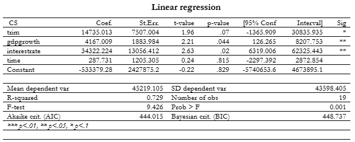
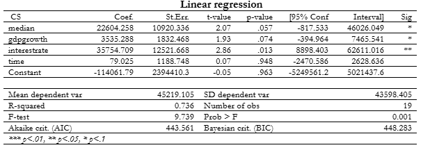
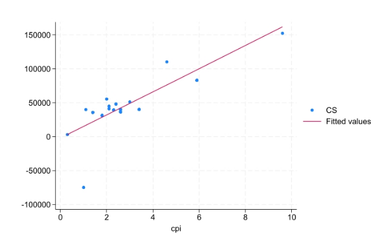
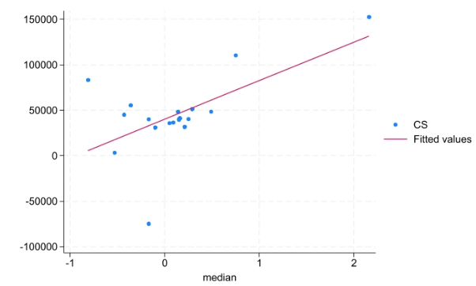

# What is the Impact of Inflation on Consumer Spending in Canada?
## Overview
This research project aims to analyse the impact of inflation on consumer behaviour in Canada through econometric analyses using four regression models with distinct inflation indicators. The research and analysis was conducted across a 20-year period from 2004 to 2023.

## Code
[Download the Stata do-file](Carter-Goveas.do)

## Data
[Download the Stata csv file](Carter-Goveas.csv)

## Methodology
### Model 1: Regressing Consumer Spending (CS) on Consumer Price Index (cpi) and Gross Domestic Product Growth (gdpgrowth) and Interest Rate (interestrate) and a time trend variable (time).

### Model 2: Regressing Consumer Spending (CS) on Gross Domestic Product Deflator (deflator) and Gross Domestic Product Growth (gdpgrowth) and Interest Rate (interestrate) and a time trend variable (time)

### Model 3: Regressing Consumer Spending (CS) on Consumer Price Index Trim (trim) and GDP Growth (gdpgrowth) and Interest Rate (interestrate) and a time trend variable (time)

### Model 4: Regressing Consumer Spending (CS) on Consumer Price Index Median (median) and GDP Growth (gdpgrowth) and Interest Rate (interestrate) and a time trend variable (time)

## Results
### Model 1 - Cochrane-Orcutt Regression

### Model 2 - Cochrane-Orcutt Regression

### Model 3 - Pooled OLS Regression

### Model 4 Pooled OLS Regression

## Figures
### Figure 1 - Twoway Scatterplot between Consumer Spending and CPI

### Figure 2 - Twoway Scatterplot between Consumer Spending and CPI Median

## Limitations
coming soon...

## Key Findings
- There is a strong positive relationship between inflation and consumer spending. This means that as inflation increased in Canada, so did Consumer Spending.
- The independent variables were shown to be significant with an exception of GDP deflator.
- CPI was shown to be a very significant variable.
- The control variables (GDP growth and interest rate) were significant and therefore suggest a strong relationship with consumer spending.

## Data Sources/References
All data sources/references can be found in the original paper: [Carter Goveas Project](Carter_Goveas_Project.pdf)
