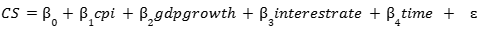
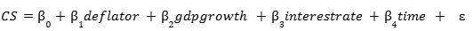
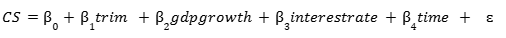
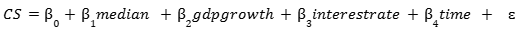
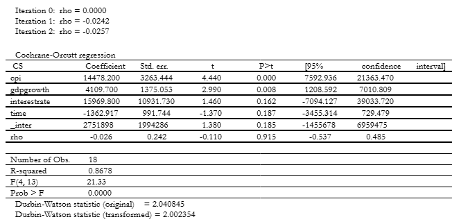
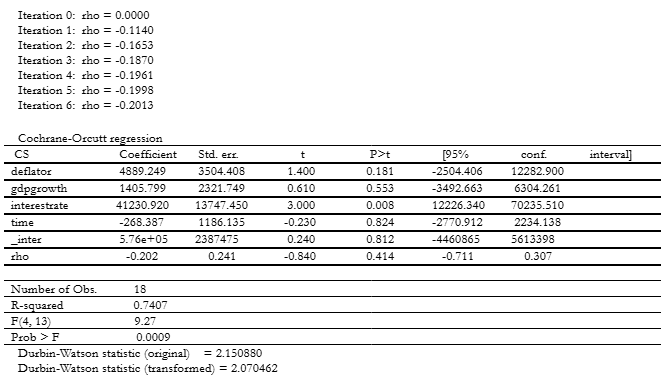

# What is the Impact of Inflation on Consumer Spending in Canada?
## Overview
This research project aims to analyse the impact of inflation on consumers behaviour in Canada through econometric analyses using four regression models with distinct inflation indicators.

## Code
[Download the Stata do-file](Carter-Goveas.do)

## Data
[Download the Stata csv file](Carter-Goveas.csv)

## Methodology
### Model 1: Regressing Consumer Spending (CS) on Consumer Price Index (cpi) and Gross Domestic Product Growth (gdpgrowth) and Interest Rate (interestrate) and a time trend variable (time).

### Model 2: Regressing Consumer Spending (CS) on Gross Domestic Product Deflator (deflator) and Gross Domestic Product Growth (gdpgrowth) and Interest Rate (interestrate) and a time trend variable (time)

### Model 3: Regressing Consumer Spending (CS) on Consumer Price Index Trim (trim) and GDP Growth (gdpgrowth) and Interest Rate (interestrate) and a time trend variable (time)

### Model 4: Regressing Consumer Spending (CS) on Consumer Price Index Median (median) and GDP Growth (gdpgrowth) and Interest Rate (interestrate) and a time trend variable (time)

## Results:
### Model 1 - Cochrane-Orcutt Regression

### Model 2 - Cochrane-Orcutt Regression

### Model 3 - Pooled OLS Regression

### Model 4 Pooled OLS Regression

